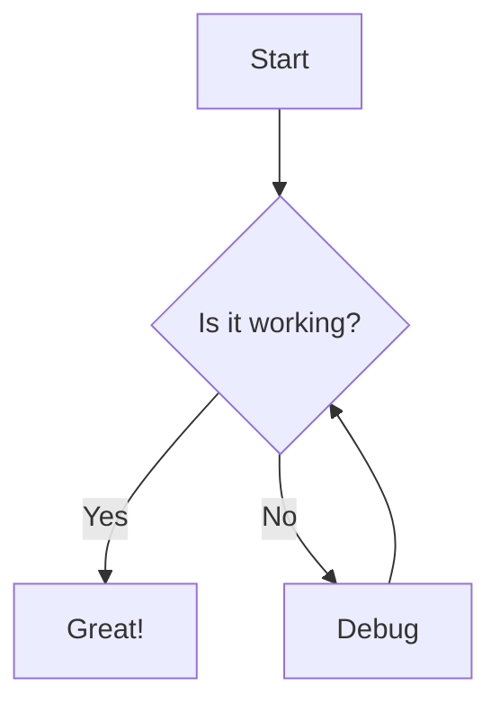
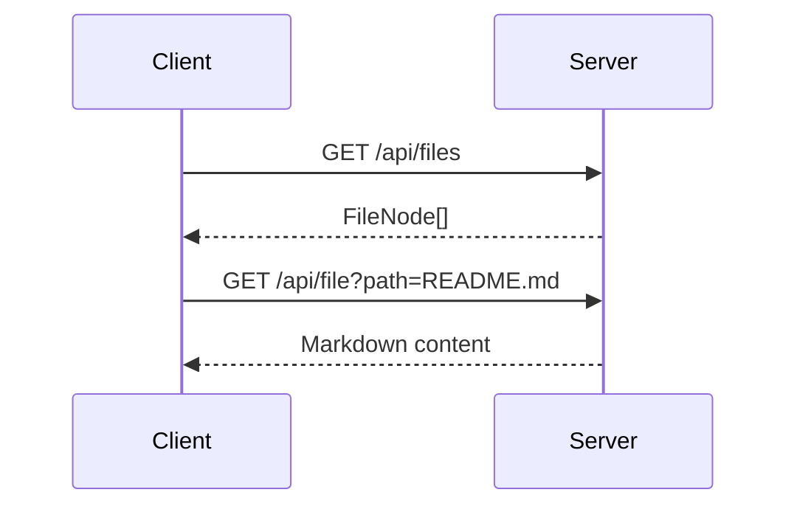
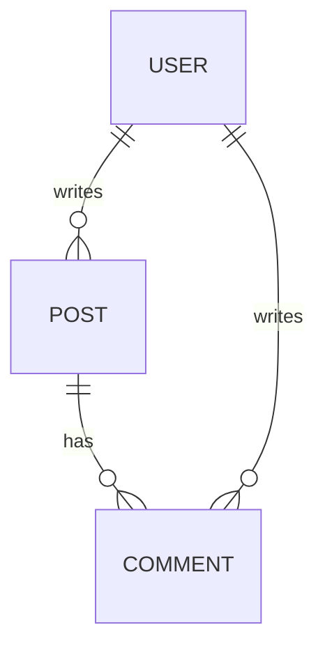

# Mermaid Test

## Flowchart


```mermaid
graph TD
    A[Start] --> B{Is it working?}
    B -->|Yes| C[Great!]
    B -->|No| D[Debug]
    D --> B
```

## Sequence Diagram


```mermaid
sequenceDiagram
    participant Client
    participant Server
    Client->>Server: GET /api/files
    Server-->>Client: FileNode[]
    Client->>Server: GET /api/file?path=README.md
    Server-->>Client: Markdown content
```

## ER Diagram


```mermaid
erDiagram
    USER ||--o{ POST : writes
    POST ||--o{ COMMENT : has
    USER ||--o{ COMMENT : writes
```

## Normal Code Block

```typescript
const hello = "world";
console.log(hello);
```
